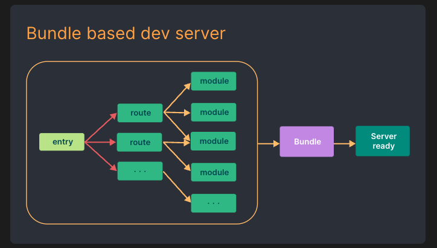
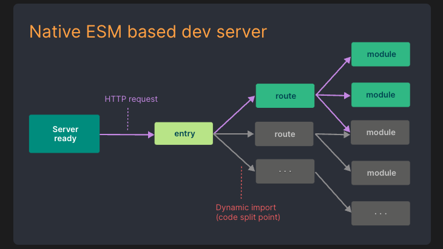
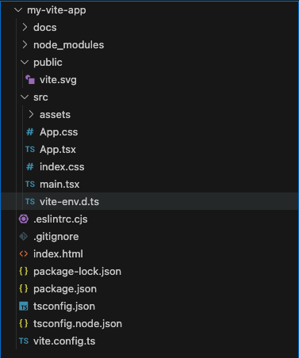

## Vite 起步

### 一、优化服务器启动

Vite 将应用中的模块区分为：<font color="#98C379">依赖</font> 和 <font color="#98C379">源码</font>。

#### 1.1 依赖

- 例如：不会变动的第三方库。
- 存在多种模块化方式：ESM、CommonJS 等。
- Vite 使用 <font color="#98C379">esbuild</font> 预构建依赖。

#### 1.2 源码

- 例如：JSX、CSS 经常会被编辑的文件。
- Vite 以 <font color="#98C379">原生 ESM</font> 方式提供源码。即让浏览器接管打包程序的部分工作，因为浏览器开始支持 <font color="#98C379">原生 ESM</font>，Vite 仅按需提供源码。

#### 1.3 Vite 与传统打包器的区别





### 二、优化更新速度

#### 2.1 传统打包器

- 构建整个应用包。部分打包器将构建产物存入内存。
- 引入了 HMR，但仍受应用规模的影响。文件修改的时候让模块图的一部分失活，将修改的部分和依赖编译生成新的模块，进行模块替换。

#### 2.2 Vite

- HMR 在 <font color="#98C379">原生 ESM</font> 上执行。
- 编辑文件仅让模块与其最近的 HMR 边界之间的链失活，仅需让浏览器重新请求该模块。
- 会利用请求头进行 <font color="#98C379">缓存</font>。

### 三、其他

- 在生产环境，原生 ESM 虽然被广泛支持，但是 Vite 建议依然进行打包，获得更好的体验。
- Vite 目前使用 <font color="#98C379">Rollup</font> 进行打包，而不是 esbuild。

### 四、Vite 基础

#### 4.1 Vite 构成

1. <font color="#98C379">开发服务器</font>。基于 <font color="#98C379">原生 ESM</font> 提供丰富的功能。

2. <font color="#98C379">构建指令</font>。使用 <font color="#98C379">Rollup</font> 打包代码，输出高度优化的静态资源。

#### 4.2 [搭建 Vite 项目](https://cn.vitejs.dev/guide/#scaffolding-your-first-vite-project)

#### 4.3 Vite 项目结构



1. 架构
   1. Vite 支持多个 `.html` 作入口点的多页面应用模式。
2. `index.html`
   1. Vite 在开发期间是一个服务器，而入口文件就是 `index.html`。
   2. Vite 将 `index.html` 视为源码和模块图的一部分。
   3. `index.html` 中的 `<script type="module" src="/src/main.tsx"></script>` 指向 JS 源码。
3. `public`
   1. 存放：不会被源码引用的资源、必须保存原文件名的文件（不经过 hash ）、不被引入只想得到地址的资源。
   2. 可以通过 `/` 路径访问到。

#### 4.4 Vite 常用命令行

```json
// package.json

{
  "scripts": {
    "dev": "vite", // 启动开发服务器，别名：`vite dev`，`vite serve`
    "build": "vite build", // 为生产环境构建产物
    "preview": "vite preview" // 本地预览生产构建产物
  }
}
```
